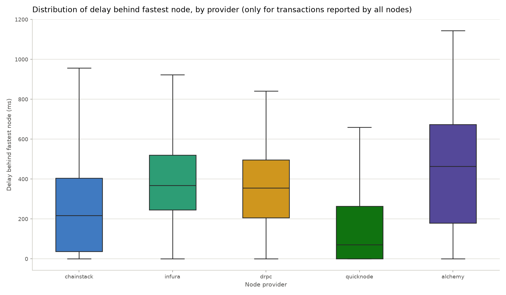
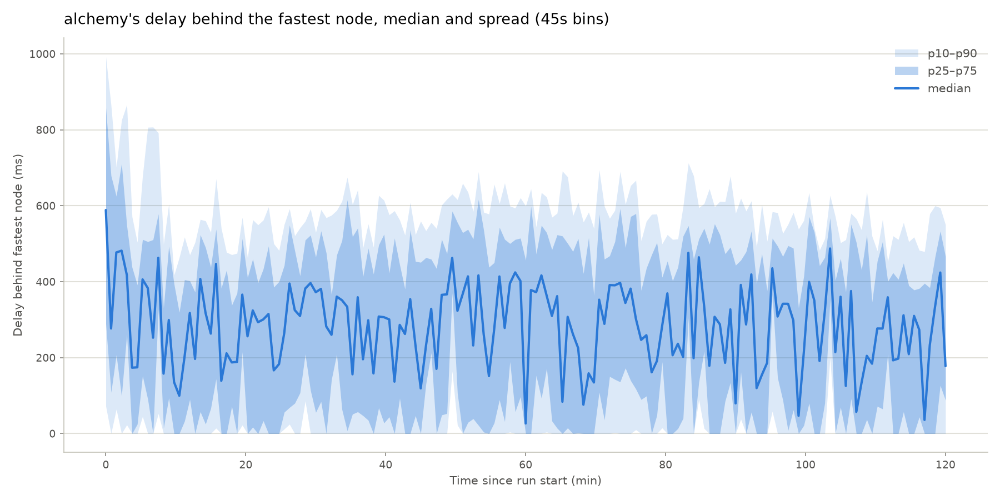

<div align="center">

# Polygon RPC Latency Bench for Polymarket


**Collects, cleans, and analyzes latency data across Polygon RPC node providers for Polymarket trades.**
</div>


## Overview

Polymarket trades settle on the Polygon blockchain, where each completed trade’s exchange contract emits an `OrderFilled` event. This tool subscribes, at the same time, to multiple RPC node providers who stream these events, timestamps each provider’s delivery of every trade with nanosecond precision, and visualizes the latency data. This is useful if you’re choosing between multiple providers for Polymarket tooling where reading real-time trade data as quickly as possible is crucial.

This program runs in three stages, each with its own command:

| Stage | Command | Output |
|-------|---------|--------|
| **Collect** | `python -m src collect` | `data/raw/run_<timestamp>.parquet` |
| **Clean** | `python -m src clean` | `data/processed/cleaned_run_*.parquet` |
| **Analyze** | `python -m src analyze` | `data/results/analysis_of_run_*/` |

---

## How it works

### 1. Data collection pipeline
- Concurrently opens a WebSocket connection to every provider and sends each one an identical `eth_subscribe` request for `logs` emitted by the Polymarket exchange contracts with the `OrderFilled` event topic.
- Recording only begins once **every** node has acknowledged its subscription. Each listener then discards messages until its node has been quiet for a moment so no provider has a head start.
- Each listener timestamps every incoming message with a monotonic clock the moment it arrives, then hands it off to the raw queue. JSON parsing happens in a separate task so nothing slows down the message receive loops.
- A processor drains the raw queue, extracts each message’s transaction hash, and keeps only the **first** arrival time per node per transaction.
- A transaction is promoted to the write queue once `min_nodes_required` nodes have reported it. A background scanner also promotes transactions whose earliest report is older than `timeout_seconds`, so a transaction still gets written even if a node misses it entirely. The same mechanism protects slow nodes, since a transaction is promoted by the scanner rather than waiting forever for a report from `min_nodes_required` nodes.
- A writer task takes data from the write queue, and writes rows in batches to a Parquet file. Individual rows contain each unique trade with its transaction hash and one arrival-time column per node, stored as nanoseconds relative to the run start time. Run metadata (reference start/end times from the monotonic clock, UTC start time, and the node number to provider name mapping) is embedded in the file.
- Mid-run disconnects are logged to a `run_*.disconnects.txt` file. `stop_on_disconnect` in the config controls whether the run ends or keeps going when a node disconnects.

### 2. Data cleaning
- Removes duplicate `tx_hash` rows from a raw run file. Duplicates can occur when a transaction is promoted (e.g. by timeout) and a straggler node reports it afterwards, creating a second partial row for the same trade.
- Duplicate rows are merged by keeping each node’s earliest non-null arrival time, leaving exactly one row per transaction. Files already free of duplicates are simply moved and renamed. Run metadata is always carried over.

### 3. Data analysis
- Converts each node’s arrival time into a delay (in ms) behind the fastest node for that transaction. Therefore, the fastest provider for a given transaction has a delay of 0 ms, and a null means that provider never reported the transaction.
- For the time-series charts, transactions are binned (grouped) into fixed time intervals chosen by the user. 
- The following charts are generated:
  - **Delay boxplot**: each provider’s distribution of delay behind the fastest node, across all transactions.
  - **Median delay line plot (all providers)**: a time-binned line plot depicting every provider’s median delay behind the fastest node for each transaction over time.
  - **Fan charts (one per provider)**: a time-binned fan chart depicting the provider’s delay behind the fastest node for each transaction over time, with p10-p90 and p25-p75 regions shaded.
  - **Speed-ranking stacked bar chart**: the share of transactions each provider reported 1st, 2nd, …, or not at all ("DNR" = did not report).
  - The boxplot and speed-ranking chart are also generated a second time using only transactions that **every** node reported.

---

## Requirements

- Python 3.11+
- A WebSocket endpoint (with an API key) for each provider you want to benchmark. The default config compares five: [Chainstack](https://chainstack.com), [Infura](https://infura.io), [dRPC](https://drpc.org), [QuickNode](https://quicknode.com), and [Alchemy](https://alchemy.com).

## Installation

```bash
# Windows
git clone https://github.com/nickslept/polymarket-rpc-latency-bench.git
cd polymarket-rpc-latency-bench

python -m venv .venv
.venv\Scripts\activate

pip install -e . # installs all dependencies
```

---

## Configuration

### API keys

**1. Copy the template**

```bash
cp env.example .env
```

**2. Fill in your keys in the new ``.env`` file (note that QuickNode also needs its unique subdomain):**
```ini
QUICKNODE_SUBDOMAIN=
QUICKNODE_KEY=
CHAINSTACK_KEY=
DRPC_KEY=
ALCHEMY_KEY=
INFURA_KEY=
```

### Run settings

**All modifiable run settings can be found in `config.toml`:**

| Table | Setting | Description |
|---------|---------|-------------|
| `[promotion]` | `min_nodes_required` | Promotes a transaction into the write queue once this many unique nodes have reported it. |
| `[promotion]` | `timeout_seconds` | Promotes a transaction into the write queue if its earliest recorded timestamp is older than this many seconds. |
| `[promotion]` | `scanner_interval_seconds` | How often the scanner checks the in-memory dict (`entries`) for transactions whose earliest recorded timestamp is older than `timeout_seconds`. |
| `[writer]` | `batch_size` | Amount of rows that need to accumulate in the write queue before being added to the Parquet file. |
| `[precollection]` | `ack_timeout_seconds` | Max amount of time (in seconds) each node waits for a subscription ack before data collection. |
| `[connection]` | `ping_interval_seconds` | How often the WebSocket keepalive ping is sent. |
| `[connection]` | `ping_timeout_seconds` | How long to wait for a "pong" response from a node before considering the connection dead and force closing the connection. |
| `[connection]` | `stop_on_disconnect` | `true` = if any node disconnects mid-run, data collection safely stops. `false` = data collection continues. |
| `[filter]` | `contracts` | The Polymarket exchange contract addresses to subscribe to (CTF Exchange V2 and NegRisk CTF Exchange V2). |
| `[filter]` | `order_filled_topic` | The `OrderFilled` event topic hash used to filter the log subscription. |

**Each RPC node provider is defined by its own `[[nodes]]` entry (providers are in column order):**

| Setting | Description |
|---------|-------------|
| `name` | The provider's name, used in run metadata and chart labels. |
| `url_template` | The provider's WebSocket endpoint. API keys are added via the `.env` file (QuickNode also has a unique subdomain in addition to an API key). `url_template` may change in the future; double check your dashboard. |

> Note: Node providers can be added and removed. If you choose to add more than the five default providers, you must also add colors to the `_PROVIDER_PALETTE` and `_PLACEMENT_PALETTE` variables in `src/analysis/charts.py` so every provider (and speed rank) gets its own color.

## Usage

Run `python -m src` to list the available commands.

### 1. Collect

```bash
python -m src collect                        # runs until user presses Ctrl+C
python -m src collect --duration 100:00:00   # stops automatically after HH:MM:SS (in this example 100 hours)
```

Connects to every node, waits for all subscription acks, then starts recording the data. Progress lines print as each batch of data is written to disk. The run file is saved in `data/raw/`.

### 2. Clean

```bash
python -m src clean
```

Pick a raw file from the list. Duplicate `tx_hash` rows are merged by keeping each node’s earliest arrival time. Files that are already free of duplicate `tx_hash` rows are simply moved and renamed. Run metadata is carried over regardless. The cleaned file is saved in `data/processed/`.

### 3. Analyze

```bash
python -m src analyze
```

Pick a cleaned file from the list. Next, pick a bin size (in seconds) for the time-binned charts. Re-running with a different bin size adds new charts alongside the existing ones. All charts are saved to `data/results/analysis_of_run_*/`.

---

## Sample data

The [`sample-data/`](sample-data/) folder contains a completed run (a ~2 hour recording across the five default providers), its disconnect log, and every chart the analysis stage produced. For the time-series charts, bin sizes of 30 and 45 seconds were used. Here are two examples of what the output looks like from that folder:





> **NOTE: This is a single two-hour window from one machine on one network; it demonstrates the tool's output, not a definitive provider ranking. Latency varies by region, plan tier, and many other factors, so run your own benchmarks.**

To try the data cleaning and analysis stages without collecting your own data, move the sample `.parquet` file into `data/raw/` and run `python -m src clean` followed by `python -m src analyze`.

---

## Project structure

```
src/
├── cli.py                    # sets up CLI
├── config.py                 # loads + validates: config.toml & .env
├── schema.py                 # handles parquet schema and file metadata
├── pipeline/
│   ├── runner.py             # orchestrates a data collection run
│   ├── connections.py        # opens + closes WebSocket connections
│   ├── listener.py           # syncs nodes before data collection begins, per-node message receive loop & timestamping 
│   ├── processor.py          # message removal from raw queue, tx hash parsing, handles promotion of filled rows
│   ├── scanner.py            # handles promotion of partially filled rows
│   ├── writer.py             # writes Parquet file
│   ├── state.py              # shared state (queues, counters, events)
│   └── disconnect_logger.py  # logs when nodes disconnect
├── cleaning/
│   └── cleaner.py            # handles duplicate tx_hash rows
└── analysis/
    ├── runner.py             # orchestrates data analysis
    ├── transform.py          # prepares data for plotting 
    └── charts.py             # manages charts
```

---

## License

Released under the [MIT License](LICENSE).

Copyright &copy; 2026 Nick Sleptsov
